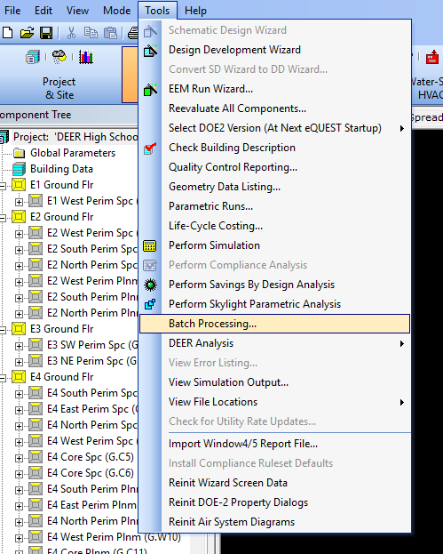

# Functioning
The basic work-flow of the batch processing is the following:

## BatchMaster and Tables
### BatchMaster
It contains a description of all the simulations the user wish to run as well as general batch processing parameters. The detailed structure of a BatchMaster file is presented in Sample Files.
### Tables
The tables contain all the different values of parameters or DOE-2 keywords used in the simulations. The detailed structure of a table is presented in Sample Files.
## eQUEST
The batch processing feature in eQUEST is in the Tools menu of the main task bar. 

Depending on your installation the batch processing feature might be greyed-out. To activate it, locate the eQUEST.INI (or eQUESTDOE23.INI if you are using DOE-2.3) in the eQUEST data folder (usually located in Documents\eQUEST 3-**** Data\). Open it in a text editor and locate the following entry:
> EnableBatchProcessing=0

Change its value from 0 to 1. If this entry is not present in your eQUEST.INI file add it under:

> [preferences]

## Input Files
## DOE-2 Simulations
## BatchMaster-Out.csv

